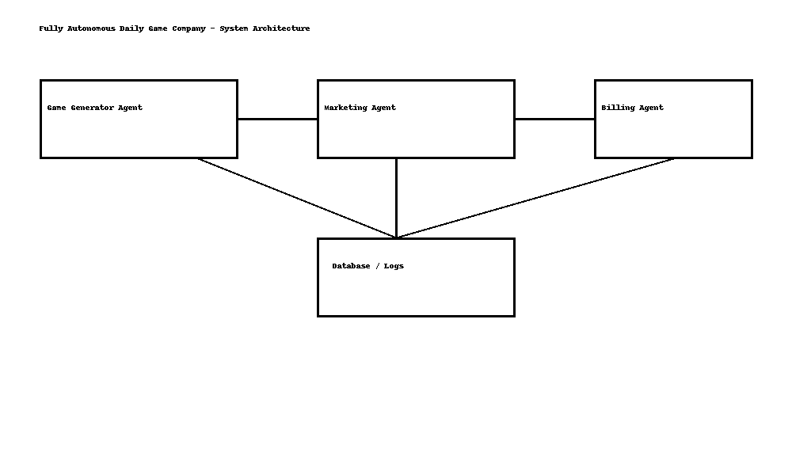

# 🚀 Fully Autonomous Daily Game Company

This project demonstrates a **multi-agent autonomous system** that runs a game company without human intervention. It uses AI agents to create and publish a new game every day, market it across social media platforms, and handle billing automatically.

---

## 🌟 Features

- **Game Generator Agent:** Creates a new JavaScript mini-game daily (HTML/CSS/JS).
- **Web Platform:** Publishes games automatically to a live website.
- **Marketing Agent:** Posts promotional ads on Twitter, LinkedIn, and Reddit (A/B testing ad copy).
- **Billing Agent:** Charges $1 per active agent per day (mock or Stripe API).
- **Persistent Logs:** Stores actions, metrics, and billing in a database.
- **Global Leaderboard:** Tracks player scores across all games.
- **Simulation:** Unit test runs a 3-day mock operation cycle.

---

## 🏗️ Architecture



**Key Technologies:**
- **Agents:** CrewAI or AutoGen, orchestrated with LangChain
- **Frontend Hosting:** Next.js deployed on Vercel
- **Database:** PostgreSQL (Supabase or SQLite for local testing)
- **Infrastructure as Code:** Terraform or Pulumi
- **Social APIs:** Twitter API, LinkedIn API, Reddit API
- **Testing:** Pytest simulating 3 days of operation

---

## 📂 Project Structure

```
daily-game-company/
│
├── README.md               # Project documentation
├── web-platform/           # Website files
├── agents/
│   ├── game_generator.py
│   ├── marketing_agent.py
│   ├── billing_agent.py
│   └── test_simulation.py
└── infra/                  # Terraform/Pulumi IaC scripts
```

---

## 🚀 How to Run Locally

1. Clone or download this repository.
2. Install Python 3.10+ and Node.js (for Next.js).
3. Run:
   ```bash
   pip install -r requirements.txt
   npm install
   npm run dev
   ```
4. Execute a 3-day simulation:
   ```bash
   python agents/test_simulation.py
   ```

---

## ✅ Deliverables for Interview

- Live website on **Vercel** hosting daily games.
- Agents auto-generating games and ads.
- Database storing actions and billing.
- Architecture diagram for clarity.
- 3-day unit test proof of automation.

---

*(This project is a demo of AI orchestration and automation, designed for interview purposes.)*
